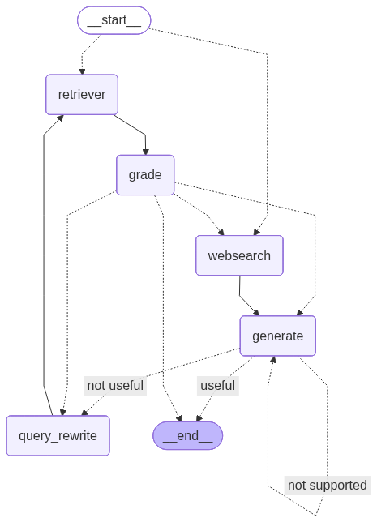

# NewsAI: Adaptive RAG for AI News Synthesis

This project is a specialized platform for technological intelligence gathering on artificial intelligence. Based on an advanced RAG (Retrieval-Augmented Generation) architecture, it uses LangGraph to create a dynamic workflow capable of synthesizing AI news from two distinct sources: PDF documents provided by the user or real-time web search.

## 📊 System Architecture Overview


*LangGraph workflow showing the adaptive RAG system for AI news synthesis*


## 🚀 Key Features

- **Dual Information Sources**: Get AI news summaries either by uploading an article (PDF or TXT file) or by directly asking a question to trigger a web search.

- **Automatic Synthesis**: The core of the system is its ability to read content (whether from a file or the web) and generate a concise and relevant summary.

- **Real-Time Web Search**: If you don't provide a document, the system uses the Tavily API to search for the latest information on the AI topic you're interested in.

- **Intelligent Auto-Correction**: Through a self-reflection mechanism, the system evaluates the relevance of found information and the quality of its own summaries to ensure reliable and accurate responses.

- **Intuitive User Interface**: The Streamlit application allows simple interaction: upload a file or ask a question to receive a clear and direct summary.

## 🏛️ Architecture

The architecture remains modular and robust, but is now optimized for news synthesis.

### User Interface (`streamlit_app.py`)
- Allows the user to choose their interaction mode: upload a document or ask a question
- Processes uploaded files or transmits the question to the graph engine
- Displays the final summary in a conversational manner

### Graph Engine (`graph.py`)
- Orchestrates the workflow with LangGraph
- The main logic is to direct the request to document processing or web search

### LLM Nodes and Chains
The internal components (retrieval, evaluation, query rewriting) are now applied either to document content or web search results to produce the best possible summary.

## 🤖 Models and Technical Components

The project relies on a selection of cutting-edge models and technologies to ensure its performance.

- **LLM Provider**: Groq
- **Model Used**: `gemma2-9b-it` - Particularly effective for synthesis, generation, and text comprehension tasks
- **Embedding Model**: Hugging Face (`sentence-transformers/all-MiniLM-L6-v2`) - Used to vectorize uploaded document content
- **Vector Database**: ChromaDB - Stores PDF document vectors to allow the system to "read" and understand content
- **Web Search API**: Tavily AI - The search engine for finding the latest AI news

## ⚙️ Request Workflow

1. **Input**: The user arrives at the Streamlit application

2. **Action Choice**:
   - **Case 1 (File provided)**: The user uploads a document. The system chunks it, vectorizes it, and stores it. The internal RAG flow is then used to extract and summarize the document's key points.
   - **Case 2 (Question asked)**: The user asks a question in the input field. The system activates the web search node (WEBSEARCH) to collect relevant articles and information.

3. **Summary Generation** (`generate`): Whether information comes from the document or the web, the gemma2-9b-it LLM is responsible for synthesizing the information into a clear and concise summary.

4. **Self-Reflection and Validation**: The summary is verified to ensure it is factual (based on the source) and properly responds to the user's implicit request.

5. **Display**: The final summary is presented to the user in the chat interface.

## 🛠️ Installation and Usage

### Prerequisites
- Python 3.10+
- A package manager like pip

### 1. Clone the Repository
```bash
git clone <REPOSITORY_URL>
cd <REPOSITORY_NAME>
```

### 2. Install Dependencies
```bash
python -m venv venv
source venv/bin/activate  # On Windows: venv\Scripts\activate
pip install -r requirements.txt
```

### 3. Configure Environment Variables
Create a `.env` file with your API keys:
```env
# .env
GROQ_API_KEY="gsk_..."
TAVILY_API_KEY="tvly-..."
```

### 4. Launch the Application
```bash
streamlit run streamlit_app.py
```

Open your browser at `http://localhost:8501`. You can now upload a document or ask a question to get an AI news summary.

## 📁 Project Structure
```
NewsAI/
├── streamlit_app.py    # Streamlit user interface
├── graph.py           # LangGraph graph engine
├── requirements.txt   # Python dependencies
├── .env              # Environment variables (to create)
└── README.md         # This file
```

## 🚀 Usage Examples

### Document Upload Mode
1. Upload a PDF or TXT file containing AI-related content
2. The system will automatically process and summarize the document
3. Receive a concise summary of the key points

### Question Mode
1. Type a question about AI news or topics
2. The system searches the web for relevant information
3. Get a synthesized summary from multiple sources

## 🔧 Configuration

### API Keys Required
- **Groq API Key**: For LLM inference
- **Tavily API Key**: For web search functionality

### Supported File Formats
- PDF documents
- Plain text files (.txt)

## 🤝 Contributing

Contributions are welcome! Please feel free to open an issue or submit a pull request.

1. Fork the repository
2. Create your feature branch (`git checkout -b feature/AmazingFeature`)
3. Commit your changes (`git commit -m 'Add some AmazingFeature'`)
4. Push to the branch (`git push origin feature/AmazingFeature`)
5. Open a Pull Request


## 🙏 Acknowledgments

- [LangGraph](https://github.com/langchain-ai/langgraph) for the graph-based workflow
- [Groq](https://groq.com/) for fast LLM inference
- [Tavily](https://tavily.com/) for web search capabilities
- [Streamlit](https://streamlit.io/) for the user interface
- [NSKAI](https://www.nskai.org/) for the tranning bootcamp

---

⭐ **Don't forget to star the project if you found it useful!**
